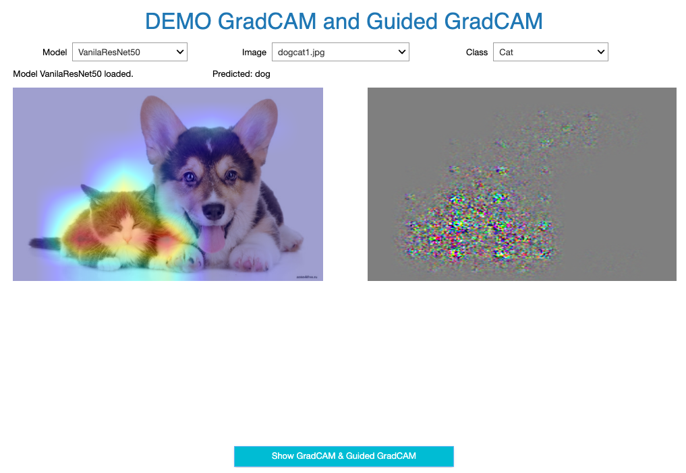

# Demo GradCAM & Guided GradCAM
> On [Dogs vs. Cat data](https://www.kaggle.com/c/dogs-vs-cats)

> Architecture: ResNet50 & ResNet50 + FC layers

## Installation
```bash
bash requirements.txt
```

## Demo
Run file `Visualization.ipynb`

